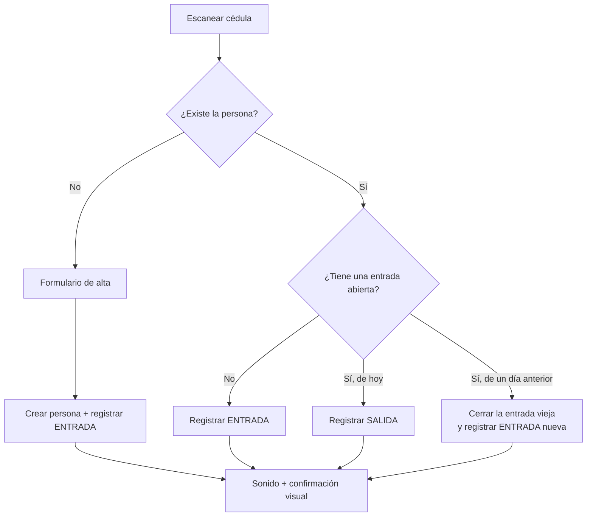

# 🏫 Sistema de Registro de Ingreso

**Control de acceso para instituciones educativas.** El portero escanea una cédula y el sistema decide solo si es una entrada o una salida. El administrador ve en tiempo real quién está dentro, con historial auditable y reportes exportables.


🔗 **Demo:** https://registro-ingreso-72ef6.web.app

<!-- CAPTURAS DE PANTALLA
     Un README de portafolio se ve mucho mejor con imágenes.
     Cuando tenga el sistema desplegado:
       1. Cree la carpeta  capturas/
       2. Guarde ahí  recepcion.png  y  admin.png
       3. Borre estas dos líneas de comentario para que la tabla se vea

| Recepción | Panel administrativo |
|---|---|
|  |  |
-->

---

## 📋 Tabla de Contenidos

- [El problema](#-el-problema)
- [Cómo funciona](#-cómo-funciona)
- [Características](#-características)
- [Stack](#-stack)
- [Decisiones técnicas](#-decisiones-técnicas)
- [Modelo de datos](#-modelo-de-datos)
- [Seguridad](#-seguridad)
- [Puesta en marcha](#-puesta-en-marcha)
- [Despliegue](#-despliegue)
- [Estructura del proyecto](#-estructura-del-proyecto)
- [Solución de problemas](#-solución-de-problemas)
- [Roadmap](#-roadmap)
- [Autor](#-autor)

---

## 🎯 El problema

En la mayoría de colegios el control de acceso sigue siendo un cuaderno en la portería. Eso significa:

- Nadie sabe con certeza **cuántas personas hay dentro** en un momento dado — dato crítico en una evacuación.
- Buscar "¿cuándo entró esta persona la semana pasada?" implica revisar páginas a mano.
- La letra manuscrita se presta a errores y a registros ilegibles.
- No hay forma práctica de auditar quién registró qué.

Este sistema reemplaza el cuaderno por un escáner de código de barras (o el teclado, si no hay lector) y deja el histórico consultable, filtrable y exportable.

---

## ⚙️ Cómo funciona

El corazón del sistema es que **el operador no elige entre "entrada" y "salida"**: escanea, y el sistema deduce cuál corresponde. Menos decisiones en portería significa menos errores y filas más cortas.



Para visitantes se pide además el motivo de la visita antes de registrar la entrada.

---

## ✨ Características

### 🚪 Módulo de recepción

- Escaneo de cédula o carnet con detección automática de entrada/salida
- Alta de personas nuevas sin salir de la pantalla del escáner
- Motivo de visita obligatorio para visitantes
- Realimentación inmediata: sonido propio, color y mensaje grande legible a distancia
- Contador de personas en sitio en tiempo real (listener de Firestore)
- Tabla de los registros del día
- Funciona sin internet: la persistencia offline encola los registros y sincroniza al volver la conexión

### 📊 Panel administrativo

- Tarjetas de estadísticas por tipo de persona
- Gráfica de barras de entradas de los últimos 7 días y torta de distribución por tipo
- Tabla de quién está dentro **ahora**, con tiempo transcurrido y botón para cerrar salidas olvidadas
- Filtros por período (hoy, semana, mes, rango personalizado), tipo y cédula
- Historial completo por persona
- Exportación a CSV de registros, personas y del reporte de "en sitio"
- Creación de usuarios del sistema sin cerrar la sesión del administrador

### 👥 Gestión de personas

- Importación masiva desde Excel con plantilla descargable
- Vista previa antes de importar: marca fila por fila los nuevos, los duplicados y los errores
- Importación por lotes con barra de progreso
- Búsqueda, edición y eliminación
- Herramienta de normalización para datos heredados de versiones anteriores

---

## 🛠 Stack

| Tecnología | Uso |
|---|---|
| **JavaScript (ES6+)** | Lógica del cliente, sin framework |
| **Firebase Authentication** | Login por correo y contraseña |
| **Cloud Firestore** | Base de datos en tiempo real |
| **Firestore Security Rules** | Autorización por rol, del lado del servidor |
| **Firebase Hosting** | Despliegue |
| **Chart.js** | Gráficas del dashboard |
| **SheetJS (XLSX)** | Lectura de archivos Excel |
| **SweetAlert2** | Modales y notificaciones |
| **CSS3** | Diseño responsive y modo oscuro, sin framework |

> Proyecto **100% frontend**: no hay servidor propio. El navegador habla directamente con Firebase, y la autorización vive en las reglas de Firestore.

---

## 🧠 Decisiones técnicas

Esta sección documenta las decisiones que no son obvias y el motivo detrás de cada una.

### La cédula es el ID del documento

`personas/{cedula}` en vez de `personas/{idAleatorio}` con la cédula como campo. Tres beneficios de una sola decisión:

- **Unicidad garantizada por la base de datos.** No hay forma de crear dos personas con el mismo número, ni siquiera con dos pestañas abiertas.
- **Búsqueda en una sola lectura directa** en lugar de una consulta con índice — el escáner responde más rápido y cuesta menos.
- **Importaciones idempotentes**: reimportar el mismo Excel actualiza en vez de duplicar.

### El cambio entrada→salida es una transacción

Leer el estado y después escribirlo son dos operaciones: entre una y otra caben un doble Enter del lector de código de barras o una segunda portería escaneando a la misma persona. El resultado serían dos entradas abiertas y un conteo de "personas en sitio" incorrecto.

La solución es una transacción de Firestore sobre `personas/{cedula}`, que guarda el ID del registro abierto:

```js
await db.runTransaction(async (t) => {
    const persona = await t.get(personaRef);
    const activo  = persona.data().registroActivo;
    // ...todas las lecturas antes de cualquier escritura
    if (hayEntradaAbierta && fechaActiva === hoy) {
        t.update(registroRef, { salida: ahoraServidor() });
        t.update(personaRef,  { registroActivo: null, fechaActiva: null });
    } else {
        t.set(nuevoRef, { /* ...entrada... */ });
        t.set(personaRef, { registroActivo: nuevoRef.id, fechaActiva: hoy }, { merge: true });
    }
});
```

Firestore reintenta la transacción automáticamente si otro cliente tocó el documento, así que la operación es atómica sin necesidad de bloqueos.

### Las fechas se calculan en hora local, nunca con `toISOString()`

`new Date().toISOString().split('T')[0]` devuelve la fecha **en UTC**. Colombia es UTC-5, así que todo lo registrado después de las 7:00 p.m. quedaría guardado con la fecha del día siguiente: la tabla de "hoy", el contador de personas en sitio y los reportes diarios saldrían mal cada noche.

```js
function fechaLocalStr(fecha = new Date()) {
    const y = fecha.getFullYear();
    const m = String(fecha.getMonth() + 1).padStart(2, '0');
    const d = String(fecha.getDate()).padStart(2, '0');
    return `${y}-${m}-${d}`;
}
```

### Las horas las pone el servidor, no el computador de la portería

Un equipo con la hora mal configurada guardaría registros con horas falsas y nadie lo notaría. Se usa `serverTimestamp()`, y la regla `entrada == request.time` hace que Firestore **rechace** cualquier otra hora, incluso si alguien modifica el JavaScript desde la consola del navegador.

Como contrapartida, un registro hecho sin internet llega vacío hasta que el servidor lo confirma; por eso se lee con `doc.data({ serverTimestamps: 'estimate' })` y la tabla muestra la hora aproximada en vez de un guión.

### Todo dato que sale a pantalla va escapado

Los nombres y motivos los escribe una persona. Insertarlos crudos con `innerHTML` significa que alguien registrado como `` ejecutaría código en la sesión del administrador. Cada valor pasa por `esc()`, y los botones de las tablas cambiaron de `onclick="fn('${nombre}')"` a atributos `data-*` con delegación de eventos — de paso, eso arregló que un apellido con apóstrofe (`O'BRIEN`) rompiera el botón.

### Protección contra inyección de fórmulas en los CSV

Un nombre que empiece por `=`, `+`, `-` o `@` es interpretado como fórmula al abrir el CSV en Excel. `csvCampo()` antepone una comilla simple y entrecomilla cada campo antes de exportar.

### Entradas que nadie cerró

En la práctica siempre hay quien se va sin marcar salida. Ese registro quedaría abierto para siempre y ensuciaría el conteo. Se resuelve por dos vías: al siguiente escaneo de esa persona el sistema cierra la entrada vieja (marcada con `cierreAutomatico: true`, para distinguirla en el histórico) y abre la nueva; y el administrador tiene un botón para cerrar manualmente cualquier entrada abierta.

---

## 🗄 Modelo de datos

### `users/{uid}`

El ID del documento es el UID de Firebase Authentication.

```
├── email: "admin@colegio.com"
└── role:  "admin" | "recepcionista"
```

### `personas/{cedula}`

El ID del documento es la cédula.

```
├── cedula:         "1234567890"
├── nombre:         "JUAN PÉREZ"
├── tipo:           "empleado" | "estudiante" | "visitante"
├── creadoEn:       Timestamp
├── registroActivo: "abc123" | null   ← ID del registro abierto
├── fechaActiva:    "2026-09-08" | null
└── actualizadoEn:  Timestamp
```

### `registros/{autoID}`

```
├── cedula:           "1234567890"
├── nombre:           "JUAN PÉREZ"
├── tipo:             "estudiante"
├── motivo:           ""  (obligatorio solo en visitantes)
├── entrada:          Timestamp  (hora del servidor)
├── salida:           Timestamp | null
├── registradoPor:    "recepcion@colegio.com"
├── fecha:            "2026-09-08"  (fecha local, para filtrar por día)
└── cierreAutomatico: true  (solo si lo cerró el sistema)
```

`nombre` y `tipo` se copian en cada registro a propósito: si mañana se corrige el nombre de una persona, el histórico conserva cómo se llamaba en ese momento.

### Índices

Están declarados en `firestore.indexes.json` y se publican con el proyecto. Son cuatro y responden a consultas concretas:

| Índice | Consulta que lo necesita |
|---|---|
| `fecha ↓, entrada ↓` | Filtros por rango de fechas del panel |
| `fecha ↑, entrada ↓` | Registros del día en recepción |
| `cedula ↑, entrada ↓` | Historial de una persona |
| `fecha ↑, salida ↑, entrada ↑` | Personas en sitio |

---

## 🔐 Seguridad

El control de roles del JavaScript (redirigir según el rol, ocultar botones) es **solo experiencia de uso**. Cualquiera puede abrir la consola del navegador y saltárselo. La autorización real está en `firestore.rules`, que se evalúa en los servidores de Google.

| Colección | Recepcionista | Administrador |
|---|---|---|
| `users` | lee solo su propio documento | lee todos; crea y edita (nunca el suyo) |
| `personas` | lee, crea y edita | además elimina |
| `registros` | lee, crea entradas y cierra salidas | además edita y elimina |

Garantías que impone el servidor:

- **Nadie puede ascenderse a admin.** La escritura en `users` está reservada al administrador, y un admin no puede editar su propio documento.
- **El histórico es auditable.** Un operador solo puede cerrar una entrada abierta: no puede cambiar la hora de entrada, ni el nombre, ni la cédula, ni borrar el registro.
- **Cada registro va firmado.** `registradoPor` se valida contra el correo del token de autenticación, no contra lo que envíe la aplicación.
- **La hora es la del servidor.** `entrada == request.time`.
- **La salida nunca es anterior a la entrada.**
- **Los datos se validan al escribir**: formato de cédula, tipos permitidos, longitud de los campos, coherencia del motivo con el tipo de persona, y que la cédula del documento coincida con su ID.
- **Todo lo demás está cerrado** por una regla explícita al final del archivo.

> ℹ️ La `apiKey` de Firebase es pública por diseño: el navegador la expone siempre. Lo que protege los datos son estas reglas más la restricción de la llave por dominio en Google Cloud Console.

---

## 🚀 Puesta en marcha

### Requisitos

- Una cuenta de Google y un proyecto en [Firebase](https://console.firebase.google.com)
- [Node.js](https://nodejs.org) 18 o superior (solo para la CLI de Firebase)

### 1. Crear el proyecto en Firebase

En la consola de Firebase: **Agregar proyecto**, y dentro de él activar:

- **Authentication** → método **Correo electrónico/contraseña**
- **Cloud Firestore** → crear base de datos (modo producción; las reglas de este repositorio la protegen)

### 2. Conectar el código con el proyecto

Copiar la configuración de **⚙ Configuración del proyecto → Sus apps → Web** y pegarla en `js/firebase-config.js`:

```js
const firebaseConfig = {
    apiKey: "...",
    authDomain: "SU-PROYECTO.firebaseapp.com",
    projectId: "SU-PROYECTO",
    storageBucket: "SU-PROYECTO.firebasestorage.app",
    messagingSenderId: "...",
    appId: "..."
};
```

> La consola de Firebase entrega ese fragmento con `import` del SDK modular. Este proyecto usa el **SDK compat** (etiquetas `<script>`), así que solo se copia el objeto `firebaseConfig`, no las líneas `import`.

Y poner el ID del proyecto en `.firebaserc`:

```json
{ "projects": { "default": "SU-PROYECTO" } }
```

### 3. Crear el primer administrador

Este paso es manual **a propósito**: las reglas impiden que alguien se asigne un rol a sí mismo desde la aplicación, así que el primer admin nace en la consola.

1. **Authentication → Users → Agregar usuario**: correo y contraseña. Copiar el **UID**.
2. **Firestore → Iniciar colección** llamada `users`.
3. Crear un documento con **ID = ese UID** y dos campos de texto:
   - `email`: el mismo correo
   - `role`: `admin`

Los demás usuarios ya se crean desde el panel administrativo.

### 4. Asegurar la llave y los dominios

- **Google Cloud Console → APIs y servicios → Credenciales → su API key → Restricciones de sitios web**: agregar `SU-PROYECTO.web.app` y `localhost`.
- **Firebase → Authentication → Settings → Dominios autorizados**: confirmar que estén `SU-PROYECTO.web.app` y `SU-PROYECTO.firebaseapp.com`.

---

## 📦 Despliegue

### Una sola vez

```bash
npm install -g firebase-tools
firebase login
```

### Publicar

```bash
firebase use SU-PROYECTO

# Reglas e índices primero: son la seguridad y las consultas
firebase deploy --only firestore:rules,firestore:indexes

# La página
firebase deploy --only hosting

# O todo junto
firebase deploy
```

Los índices tardan unos minutos en construirse. Mientras tanto el panel puede mostrar "Error al cargar registros"; el avance se ve en **Firestore → pestaña Índices**.

### Probar en local

```bash
firebase serve --only hosting     # http://localhost:5000
```

Se conecta a la base de datos **real**. Para probar sin tocar datos de producción:

```bash
firebase emulators:start --only firestore,auth
```

---

## 📂 Estructura del proyecto

```
registro/
├── index.html              Login
├── recepcion.html          Pantalla del escáner
├── admin.html              Panel administrativo
├── css/
│   └── styles.css          Estilos, responsive y modo oscuro
├── js/
│   ├── firebase-config.js  Configuración e inicialización
│   ├── utils.js            Fechas locales, escapado HTML, validaciones
│   ├── auth.js             Login, roles y modo oscuro
│   ├── recepcion.js        Escáner y transacción entrada/salida
│   └── admin.js            Dashboard, filtros, importación y usuarios
├── sonidos/                Sonidos propios de entrada, salida y error
├── firestore.rules         Autorización por rol (la seguridad real)
├── firestore.indexes.json  Índices compuestos
├── firebase.json           Hosting y cabeceras
└── .firebaserc             ID del proyecto
```

---

## 🔧 Solución de problemas

| Síntoma | Causa probable | Solución |
|---|---|---|
| La página siempre vuelve al login | `js/firebase-config.js` sin los datos reales | Pegar la configuración del proyecto |
| `Missing or insufficient permissions` | Falta el documento en `users` o el rol no coincide | Revisar `users/{uid}` en Firestore |
| `The query requires an index` | Los índices aún se construyen | Esperar unos minutos; ver el estado en la consola |
| `HTTP Error: 403` al desplegar reglas | La cuenta no es propietaria del proyecto | Entrar con la cuenta correcta o pedir permiso de *Editor* |
| `Error: Failed to get Firebase project` | El ID de `.firebaserc` no existe o no tiene acceso | `firebase use --add` |
| El lector escanea y no pasa nada | El foco se perdió | Hacer clic en el campo del escáner |
| Se registra la salida en vez de la entrada | La persona tenía una entrada abierta | Revisar *Personas en Sitio* y cerrarla desde el panel |

---

## 🗺 Roadmap

- [ ] Cloud Function para el cierre automático nocturno de entradas abiertas
- [ ] Rol a través de custom claims en el token, para evitar una lectura por operación
- [ ] Pruebas de las reglas con `@firebase/rules-unit-testing`
- [ ] Paginación con cursores en el panel para históricos grandes
- [ ] Notificación al acudiente cuando un estudiante sale en horario de clase
- [ ] Migración del SDK compat al SDK modular

---

## 👤 Autor

**Breiner Rodríguez**
📧 rodriguezbreiner125@gmail.com

<!-- Agregue aquí sus enlaces: GitHub · LinkedIn · Portafolio -->

---

## 📄 Licencia

MIT — libre de usar, modificar y distribuir.
